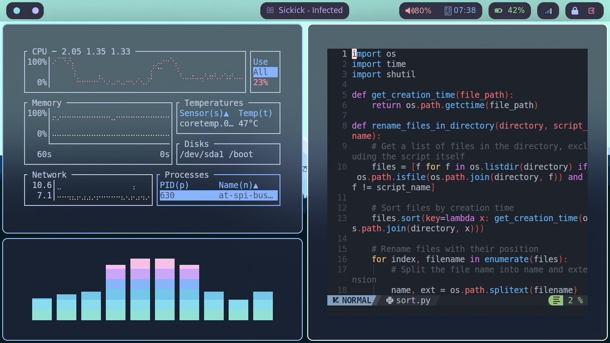

# My Hyprland Configuration For Arch Linux

Hyprland + wayland rice




## Installation
Installing this rice is very simple. Just clone this repository and move files to `~/.config'

```
git clone https://github.com/Munseer-am/dotfiles.git
cd dotfiles
cp .config/* -r ~/.config
```
> You should create a link .zhrc to ~/.config/zsh/.zshrc
`ln ~/.zshrc ~/.config/zsh/.zshrc`

#### Wallpapers
I change wallpapers everyday. The wallpapers are available in this [Github Repo](https://github.com/D3Ext/aesthetic-wallpapers)

> Using this rice can break your system and configurations. Use at your own risk

